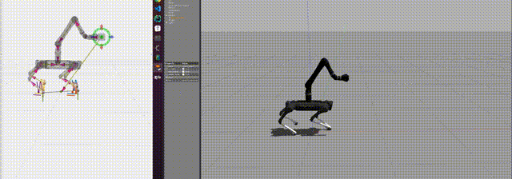
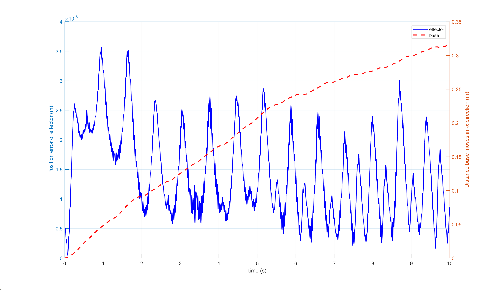
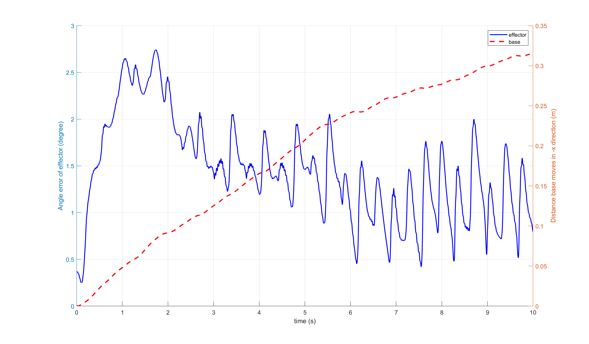

# qm_control




## Overview

qm_control is a quadruped manipulator controller using model predictive control and whole body control. We aim to make the quadruped manipulator perform better in coordination and balance. **The project is still under development, not the final version**.

***Notes:*** The controller assumes that there is no force on the end effector. If force on the end effector needs to be considered, see the [feature-force](https://github.com/skywoodsz/qm_control/tree/feature-force) branch.

## Installation

### Install dependencies

- [OCS2](https://leggedrobotics.github.io/ocs2/installation.html#prerequisites)
- [QPOASES](https://github.com/coin-or/qpOASES)
- [ROS1-Noetic](http://wiki.ros.org/noetic)

### Clone and Build

```
# Clone
mkdir -p <catkin_ws_name>/src
cd <catkin_ws_name>/src
git clone https://github.com/skywoodsz/qm_control.git

# Build
cd <catkin_ws_name>
catkin init
catkin config -DCMAKE_BUILD_TYPE=RelWithDebInfo
catkin build
```

***Notes: Make sure OCS2 in the environment path.***

## Usage

We have two versions of the controller:  **MPC with WBC** and **only MPC**.

### MPC-WBC

Launch the simulation with:

```
mon launch qm_gazebo empty_world.launch
```

Load the controller:

```
mon launch qm_controllers load_controller.launch
```

Start the controller using `rqt_controller_manager` GUI

```
rosrun rqt_controller_manager rqt_controller_manager
```

After the manipulator is initialized, commands can be sent

```
# Don't use mon
roslaunch qm_controllers load_qm_target.launch 
# rviz
mon launch qm_controllers rviz.launch
# joy
mon launch qm_controllers joy_teleop.launch
```

### MPC Only

Launch the simulation with:

```
mon launch qm_gazebo empty_world_mpc.launch
```

Load the controller:

```
mon launch qm_controllers load_controller_mpc.launch
```

## End-effector stability testing





***Analysis***: The motion of the base and end-effector pose  w.r.t. the initial pose when the end-effector is controlled to remain at a fixed pose during locomotion. While the base travels 30 cm, the end-effector’s deviation from its initial position is at most 3.5 mm and 2.6 degree.

## Bugs & Feature Requesityts

This project is still in the early stages of development and we welcome feedback.  Please report bugs and request features using the [Issue Tracker](https://github.com/skywoodsz/qm_control/issues) or Email skywoodszcn@gmail.com

## TODO

- [ ] Solve the singularity problem.
- [ ] Add the foot trajectory plannning.
